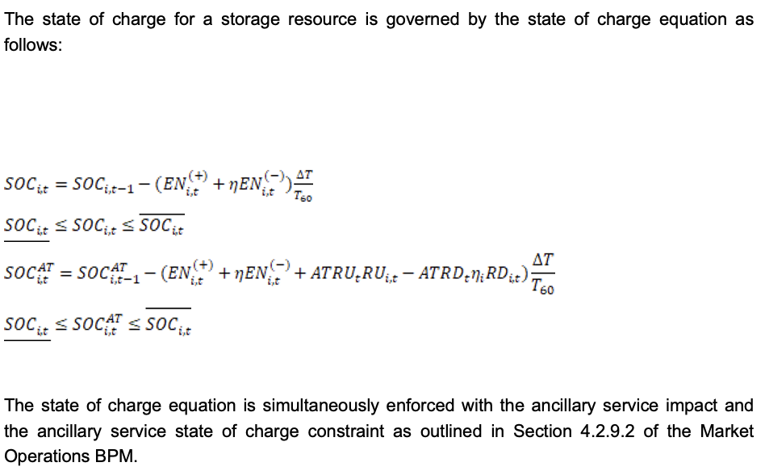

https://bpmcm.caiso.com/BPM%20Document%20Library/Market%20Operations/BPM_for_Market%20Operations_V103_Clean.doc

    6.6.2.3	Stored Energy Management
     
    This section describes how state of charge (SOC), which is measured in energy (MWh), is treated in the IFM run of the day-ahead market for NGRs designated as Limited Energy Storage Resources (LESRs).  For information on state of charge management in the real-time markets, see section 7.8.2.5.
    
